# 🎮 Zamakan – 3D Cooperative Puzzle Game

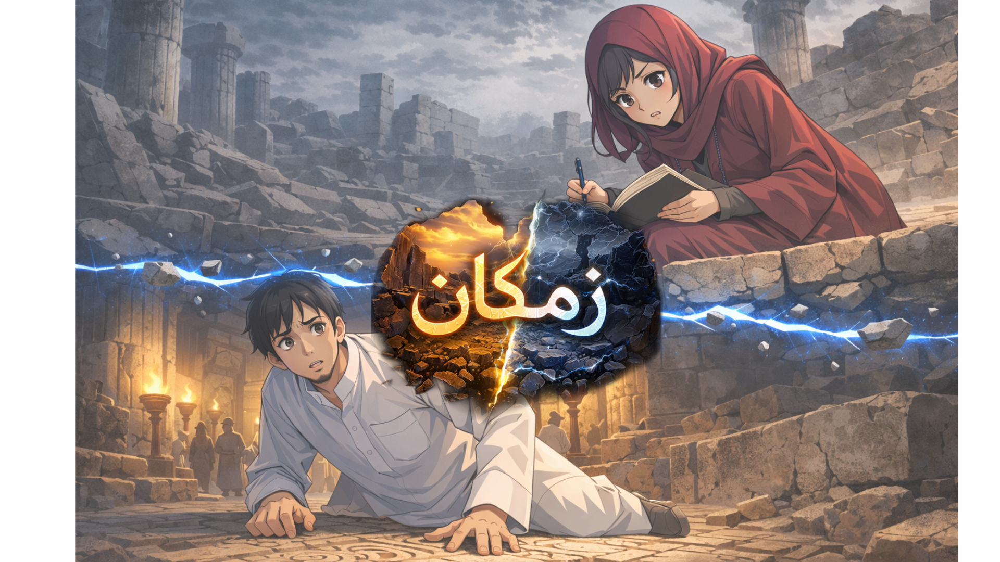

---

## Overview

Zamakan is a 3D cooperative puzzle game developed in **Unity**, inspired by the historical villages of Saudi Arabia.  
The game creates an interactive experience built around the concept of **exploring the same location across two different timelines — the past and the present**.

Players control two characters who exist in different time periods within the same archaeological site. By collaborating and exchanging information, players must solve interconnected puzzles and uncover elements of the site's historical and cultural identity.

Zamakan combines **exploration, storytelling, and puzzle-solving** to create a gameplay experience that introduces players to Saudi cultural heritage through a modern digital medium.

---
## Storytelling & Manga Panels 🎴

To strengthen the narrative experience, Zamakan begins with a sequence of original manga-style panels designed as part of the game’s visual storytelling. These panels introduce the two main characters, Sultan and Najd, and establish the mystery of the ancient artifact that connects the past and the present.

  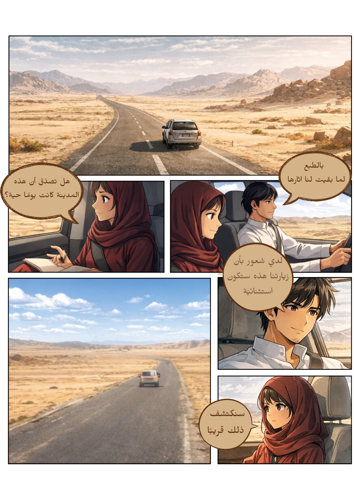
  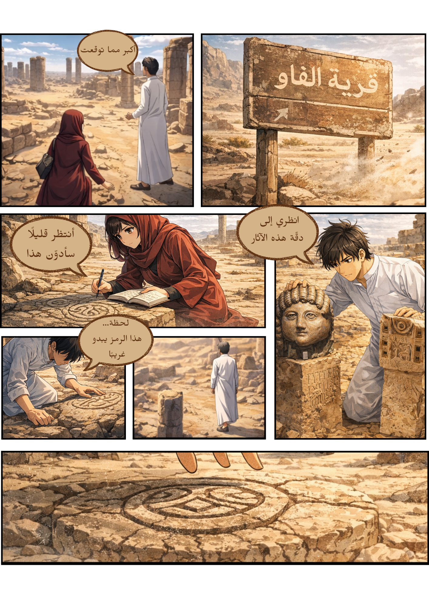
  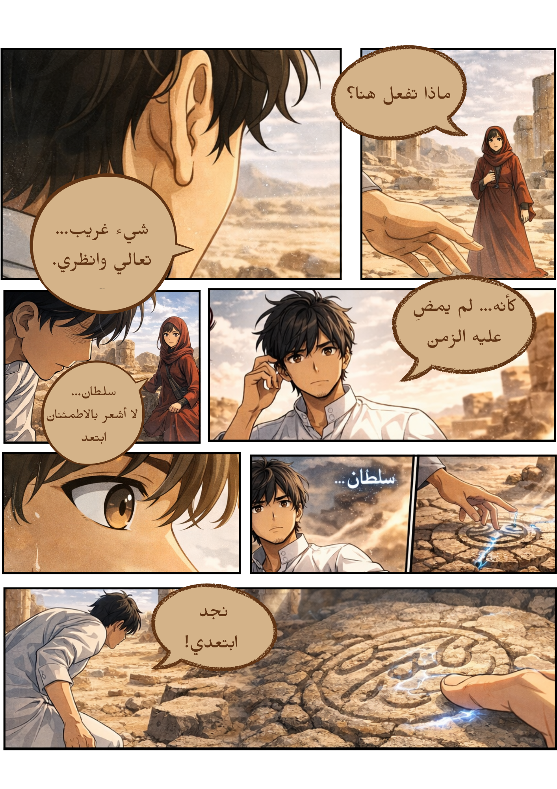
   
  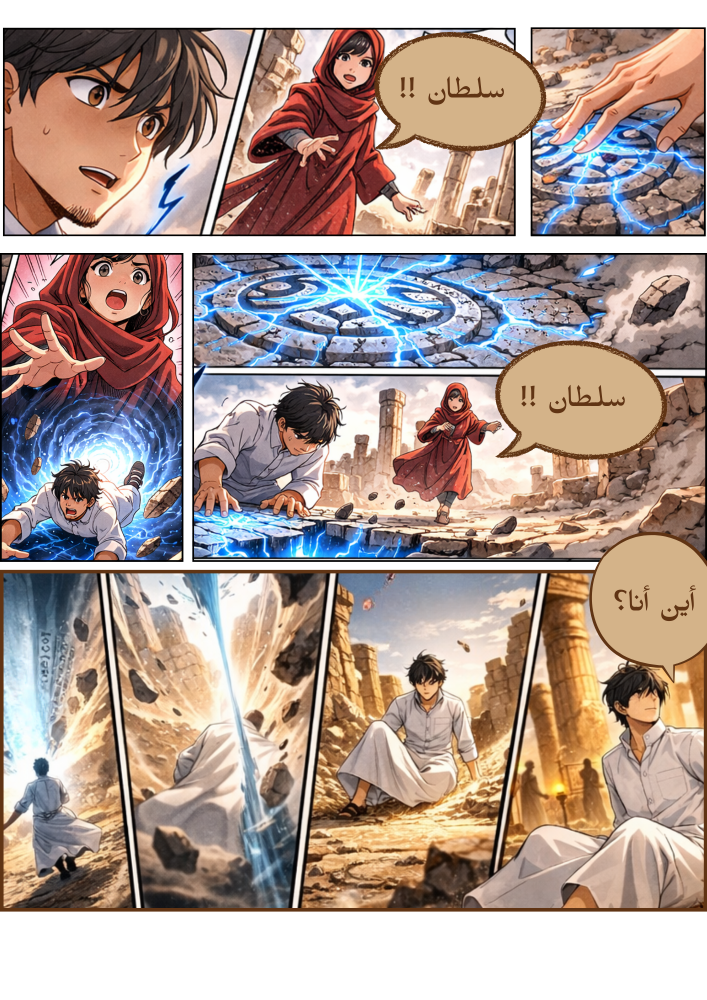
  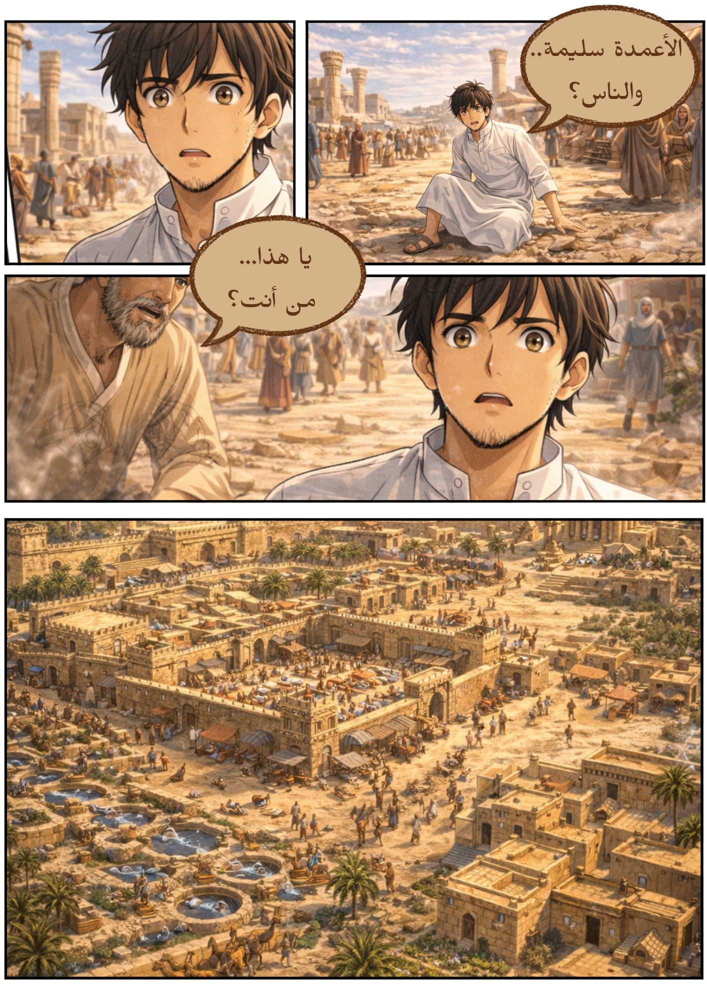

---
## Game Concept

The core concept of Zamakan revolves around **cooperative gameplay across two timelines**.

The game features two main characters:

- **Sultan** – explores the village in the **past**, experiencing it during its historical prosperity.
- **Najd** – remains in the **present**, investigating the archaeological ruins of the same location.

Because the environment exists in two different time periods, certain clues, symbols, and objects may only exist in one timeline while being altered or missing in the other.

This design encourages:

- Communication between players  
- Shared problem-solving  
- Exploration of historically inspired environments  

By combining narrative storytelling with environmental puzzles, Zamakan transforms historical exploration into an interactive gameplay experience.

---

## Gameplay Mechanics

Zamakan is designed as a **two-player cooperative puzzle game** where each player experiences the environment from a different timeline.

### Sultan – Past Timeline
- Explores the village in its original historical state
- Interacts with intact architecture and symbols
- Discovers clues that may no longer exist in the present

### Najd – Present Timeline
- Investigates the archaeological ruins of the same location
- Observes damaged or incomplete structures
- Uses environmental evidence to assist Sultan

Players must communicate and combine their observations to solve puzzles that connect both timelines.

The game emphasizes teamwork, observation, and collaborative reasoning to progress through each stage.

---

## Puzzle Design

The puzzles in Zamakan are located inside a dedicated gameplay area known as the **Puzzle Arena**.

Inside this arena, players encounter **three main puzzle stones**, each representing a different challenge within the stage.

### Puzzle System

- Puzzles must be solved **sequentially**
- Only one puzzle is active at a time
- A **visual indicator** appears above the currently active stone
- Interacting with the stone opens the puzzle interface
- After solving the puzzle, players return to the arena

Completing all three puzzles unlocks the next stage of the game.

Each puzzle is designed around **historical or cultural elements related to the environment**, allowing players to discover information about the site while progressing through the gameplay.

---

## Environment Design

The game environment is built as a fully interactive **3D historical village** inspired by the architecture of ancient settlements in Saudi Arabia.

Players can explore and interact with:

- Architectural landmarks
- Ancient carvings and symbols
- Environmental objects connected to puzzles
- Story-driven elements embedded within the village

The environment is not simply visual decoration — it plays an essential role in the gameplay by providing clues and contextual information needed to solve puzzles.

The prototype stage is inspired by **Qaryat Al-Faw**, a historically significant village in Saudi Arabia.

The project is designed to expand in the future to include additional heritage locations such as:

- Diriyah  
- Dumat Al-Jandal  

allowing Zamakan to grow into a broader interactive cultural exploration experience.

---

## 🎥 Gameplay Demo

Watch the gameplay demonstration of Zamakan to see the cooperative puzzle mechanics and exploration system in action.

▶️ **Demo Video**  
(Add your demo video link here)

The demo showcases:

- Exploration of the 3D historical environment
- The puzzle arena and puzzle stones
- Interaction between Sultan (Past) and Najd (Present)
- Cooperative puzzle-solving mechanics
- Environmental storytelling elements

---
## 📷 Gameplay Screenshots

### Puzzle Arena

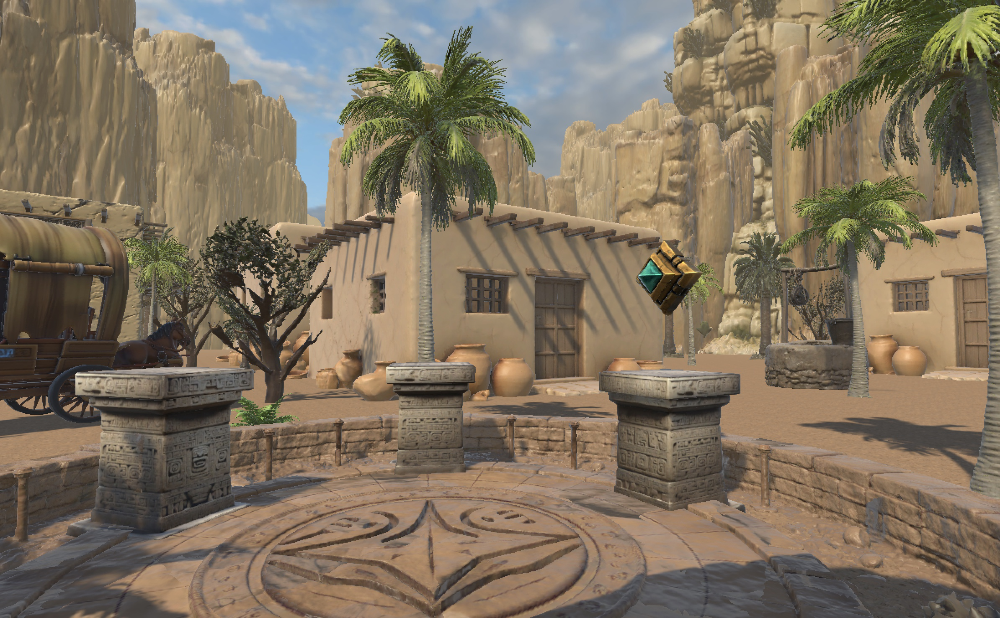

### Environments

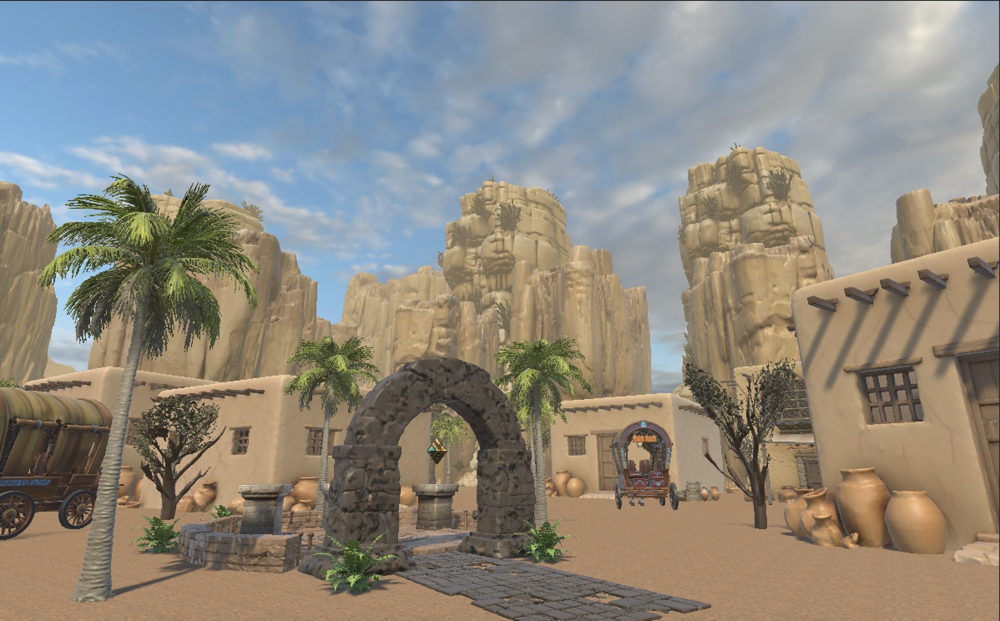
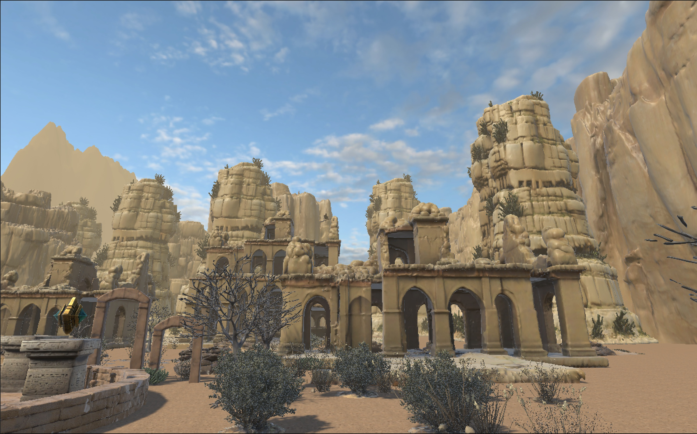

### Puzzle Interaction

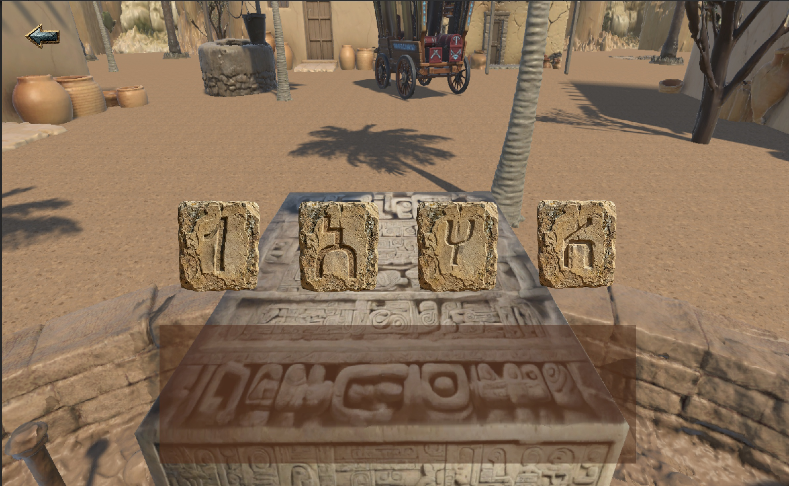
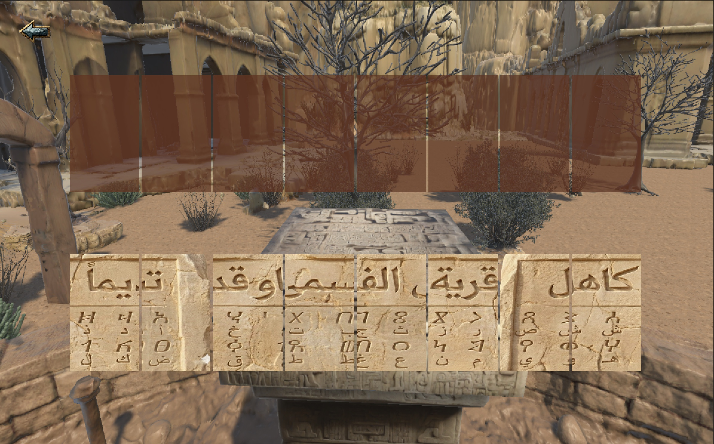

---

## 🧩 Game Architecture

Zamakan is structured using a modular architecture within the Unity game engine. The core systems include:

**Puzzle System**  
Handles puzzle activation, sequential progression, and interaction with puzzle stones.

**Timeline Interaction System**  
Manages the connection between the past and present environments, allowing players to exchange information across timelines.

**Environment Interaction System**  
Controls player interactions with environmental objects, symbols, and clues within the village.

**Player Role System**  
Separates gameplay responsibilities between Sultan (Past) and Najd (Present) to reinforce cooperative gameplay mechanics.

---

## 🛠 Technologies Used

- Unity Game Engine
- C#
- 3D Environment Design
- Game UI Design
- Puzzle System Implementation
- Cooperative Gameplay Design

---

## ✨ Features

- 3D historical environment inspired by Saudi heritage
- Dual timeline gameplay (Past & Present)
- Cooperative puzzle-solving mechanics
- Interactive puzzle arena with sequential progression
- Story-driven environmental exploration
- Cultural and historical elements integrated into gameplay
- Expandable game concept for additional historical locations

---

## 🚀 Future Improvements

- Introduce additional historical villages and environments
- Expand the narrative and character interactions
- Add more advanced puzzle mechanics
- Improve cooperative interaction systems
- Integrate cinematic storytelling elements
- Enhance environmental detail and visual immersion

---

## 👩‍💻 Author

**Hadeel Almutairi**

IT Student – Networks & IoT Engineering  
King Saud University
